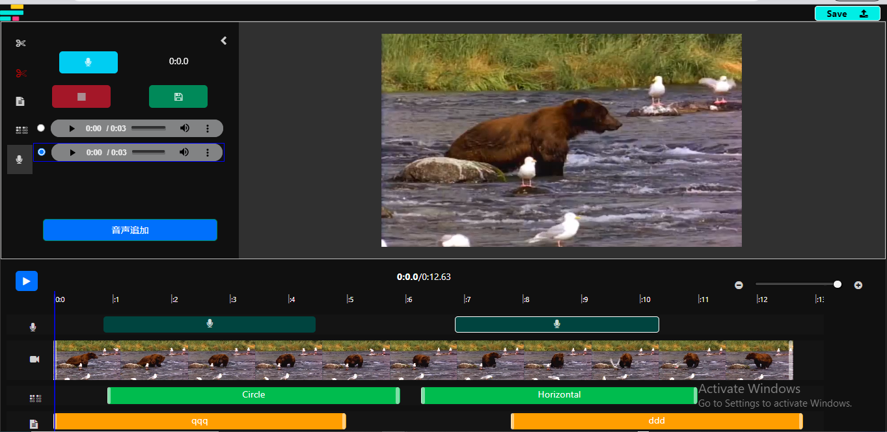
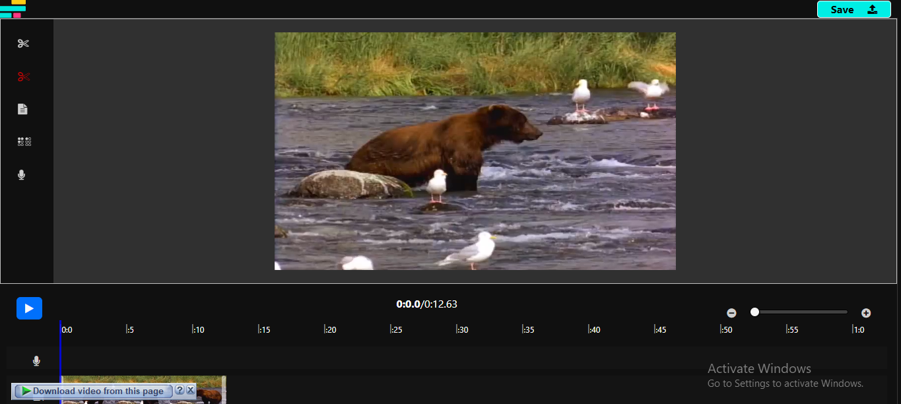
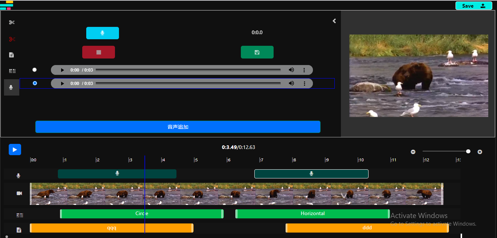

# Video Trim

> Video processing platform built by MEVN.

<!-- > Live demo [_here_](https://www..com). -->

## Table of Contents

- [General Info](#general-information)
- [Technologies Used](#technologies-used)
- [Features](#features)
- [Screenshots](#screenshots)
- [Setup](#setup)
- [Usage](#usage)
- [Project Status](#project-status)
- [Room for Improvement](#room-for-improvement)
- [Acknowledgements](#acknowledgements)
- [Contact](#contact)

## General Information

- This project is video processing work.
- It figures out cutting video, inserting audio, drawing objects.
- Purpose of this project is to provide comfortable platform of processing video for clients.
- The reason I undertook this project is to get experience in video process.

## Technologies Used

- Tech 1 - Vue.js
- Tech 2 - Express
- Tech 3 - Video work

## Features

- Slice part of video
- Insert audio
- Draw object
- Insert text

## Screenshots

## Setup

You need Node.js platform.
Install Node.js, and you need to install node_modules by using `npm install` command.

This project ffmpeg program to edit videos. You have to download the program and set environment variable.

## Usage

In the client directory, run `npm run dev`. \
In the root directory, run `npm start`.

## Project Status

Project is: _complete_.

## Room for Improvement

Room for improvement:

- Frontend as Vue.js
- Backend as Express
- Node.js Platform

To do:

- Flexible UI
- Smooth Control

## Acknowledgements

- This project was inspired by Anadamonz.
- Many thanks to Anadamonz.

## Contact

Created by [@violetstar701](https://www.) - feel free to contact me!
